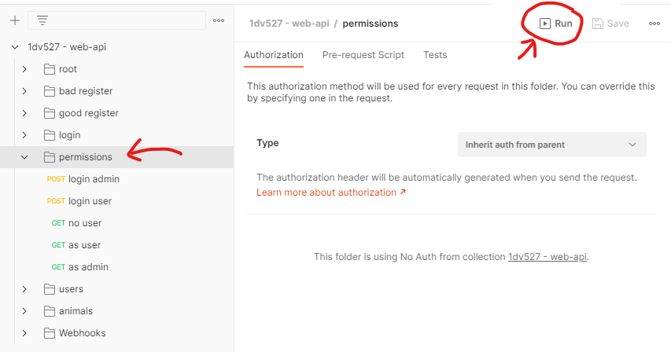

[[_TOC_]]

## Instructions

### Deployment

The API is deplyed at: [https://ol222hf-web-api.herokuapp.com/api/v1](https://ol222hf-web-api.herokuapp.com/api/v1)
The application may need some time to start up as Heroku has a sleep mode. I would recommend visiting this URL once manually to make sure the server is "awake".

### Documentation / Endpoints

All endpoints and HTTP methods used are specified in [the documentation.](Lovsveden_API_Documentation.txt)

### Postman

[Postman Collection](1dv527_web_api.postman_collection.json) 
When loading my Postman collection you'll see that I've structured all my tests by folders. The way it is meant to be tested is that you select a folder and run all the tests inside that folder all at once as a suite. Most data used/found during tests is stored in collection variables.

There are two users in the system by default:
- ``{username: Test, password: 1234567890}``
- ``{username: Admin, password: 1234567890}``

*Select a folder and hit run as shown here*

## Requirements:

* [x] The API should at least support representations with application/json
* [x] The API should try to follow the constraints for Restful APIs
* [x] The API should embrace the idea of HATEOAS. The API should have one entry point and use HATEOAS for making the API browsable.
* [x] The API should give the client possibilities to create, read, update and delete resources.
* [x] Unsafe HTTP methods and data about users in the system should require authentication done through the API with the implementation of JWT-tokens.
* [x] The API should give some ability to register a webhook, which will trigger on some of you chosen event.
* [x] In your examination repository, you should provide a [POSTMAN](https://chrome.google.com/webstore/detail/postman/fhbjgbiflinjbdggehcddcbncdddomop) collection. The examiner should be able to load this into the POSTMAN application or a [NEWMAN CLI](https://www.getpostman.com/docs/postman/collection_runs/command_line_integration_with_newman) and test your API without any further configuration. For more information about POSTMAN and NEWMAN see this article: https://scotch.io/tutorials/write-api-tests-with-postman-and-newman
* [x] Don't forget to make calls that show your error handling like bad requests, wrong credentials and so on.
* [x] The code should be published in your examination repository along with a report (see below)
* [x] Your solution should be testable without any configuration, installations of servers and so on. Preferable, the API will be testable through a public URL. Any instructions on how to test your solution should be in your repository README.md.
* [x] The code should be "individually" created, the examiners may run a code anti-plagiarism tool on your code. Plagiarism will be seriously considered and reported.
* [x] Make a script-file that automatically populated your application with some data for testing

## 5 Linguistic design rules that i prioritized:

* [x] rule 1: Forward slash separator (/) must be used to indicate a "hierarchical relationship".
* [x] rule 2: A trailing forward slash (/) should not be included in URIs.
* [ ] rule 3: Hyphens (-) should be used to improve the readability of URIs.
* [ ] rule 4: Underscores (_) should not be used in URIs.
* [ ] rule 5: Lowercase letters should be preferred in URI paths.
* [ ] rule 6: File extensions should not be included in URIs.
* [x] rule 7: A "singular" noun should be used for document names.
* [x] rule 8: A "plural" noun should be used for collection names.
* [ ] rule 9: A plural noun should be used for store names.

* [x] rule 10: CRUD function names or their synonyms should not be used in URIs.

* [ ] rule 11: A verb or verb phrase should be used for controller names.
* [ ] rule 12: The query component of a URI may be used to filter collections or stores.
* [ ] rule 13: The query component of a URI should be used to paginate collection or store results.